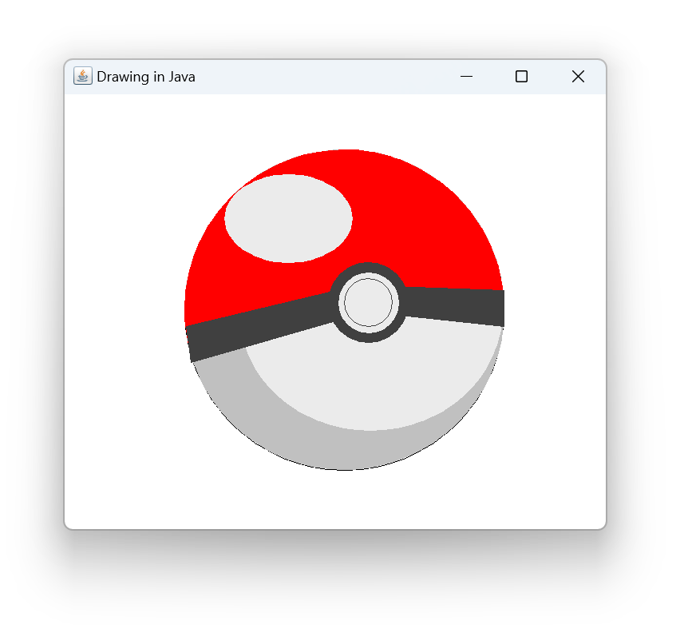

# Pokéball Drawing – Java Graphics2D

This project is a simple Java Swing application that draws a Pokéball using Java Graphics2D.

The drawing is created using basic 2D graphics concepts such as ovals, arcs, polygons, and color filling.  
It is intended as a practice project for understanding Java’s 2D rendering system.

## Features
- Uses Java Swing (`JFrame`, `JComponent`)
- Draws shapes using `Graphics2D`
- Uses:
  - Ovals and arcs
  - Polygons
  - Custom colors
- Demonstrates layering and positioning of shapes

  
## Technologies Used
- Java
- Swing
- Graphics2D

## Purpose
This project was created for learning and practicing Java 2D graphics, shape drawing, and coordinate-based rendering.

## How to Run
1. Open the project in any Java IDE (NetBeans, IntelliJ, Eclipse).
2. Run the `Pokeball` class.
3. A window will open displaying the Pokéball drawing.
